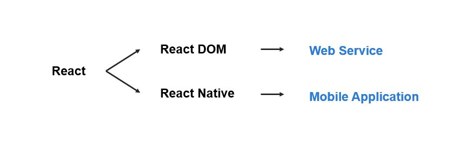

# React JS로 웹 서비스 만들기

## Why React?

### **Just Javascript**
- Javascript 기반으로 별도의 언어를 학습하지 않아도 되며, 활용도가 높다

### **Composition**
  - 요소별 컴포넌트별로 나눠 작업할 수 있는 구조
  - 개별 요소 컴포넌트의 독립성 높아 다른 곳에서 활용도 또한 높아짐
### **Unidirectional Dataflow**
  - 데이터는 항상 일정한 장소에 위치해 있고, 그 장소에서만 변경 가능(단방향 데이터플로우)  
    (Data -> UI, 데이터 변화에 따라 UI업데이트)


### **and..**
#### **React = UI 라이브러리**    
- MVC 중 **View**에 해당하기에, 나머지 부분을 python, ruby, nodejs 등 다른 것과 섞어 쓸 수 있음


- - - 

## 영화 소개 app 만들기 실습

- Component 1. Movie List 
- Component 2. Movie 
- Component 3. Movie Poster(Image)


### React 흐름 
**Component** -> **Render** -> **return** -> **JSX**

### React vs React DOM


### Data flow with Props
React의 컨셉 : prop & state
- 메인 컴포넌트가 Data 갖고 있고, props 통해 children 컴포넌트한테 정보 넘김

### Validating Props with Props Types
- API에서 데이터 많이 가져올 때, 정리 쉽게 하기 위해 배열로 저장 후 data 응용하게 됨  
  이후, array.map 메서드 통해 리스트에 뿌리는데, 리엑트는 element 많을 경우 key 값 필요로 함
- Proptypes 설정으로 부모가 보낸 데이터 타입 체크할 수 있음
  ```js
  static propTypes = {
    title : PropTypes.string.isRequired,
    poster : PropTypes.string
  }
  ```
  - `isRequired` 설정 통해 필수값 설정 가능

### Component Lifecycle
- 컴포넌트는 다양한 functions를 갖고 있고, 이를 순서대로 실행시키는데, 이를 component lifecycle이라 함
- 이는 프로그램이 작동될 때 자동으로 발생함

#### render
- **componentWillMount() -> render() -> componentDidMount()**
  - `componentWillMount()` : 컴포넌트가 실행됐음 알 수 있음
  - `render()` : 컴포넌트가 존재함 알 수 있음
  - `componentDidMount()` : 컴포넌트가 자리잡았음 알 수 있음
#### update
- **componentWillReceiveProps() -> shouldComponentUpdate() -> componentWillUpdate() -> render() -> componentDidUpdate()**
  - `componentWillReceiveProps()` : 컴포넌트가 새로운 props를 받음
  - `shouldComponentUpdate()` : old props - new props 비교 후 다를 경우, 업데이트 발생
  - `componentWillUpdate()` : update 상태
  - `componentDidUpdate()` : update 후의 상태

### Thinking in React Component State - state란?!
- **State**란 리엑트 컴포넌트 안에 있는 오브젝트
- **state update 하기 -- `setState()`**
  - `componentDidMount()`에서 컴포넌트가 마운트된 후에 update 작업함
  - `this.state = "바꿀내용"` 이렇게 직접적으로 하는 게 아니라,   
    `setState` 활용하여 변경!
  - `render()`는 state가 업데이트할 때마다 작동
  - `render()`는 처음엔 `state = {}`에서 실행되고, 후에 `setState()`에서 재실행됨!

### Practicing this setState - state 추가하기
-  `App`클래스 외부에 있던 영화 목록(`movies`)을 `state` 안으로 끌어 들인 후, 영화 추가하기
- spread oparator(`...`) 활용하여 기존 목록(`this.state.movies`) 그대로 둔 채, 영화 추가 가능
- `setState()` 활용하여 infinite scroll 등 활용할 수 있음

### Loading State -- `setTimeout`으로 API call 구현하기
- **API call** : Component Loading without API -> call API(for data) -> API return data -> update my component's state  
- class 내 메서드에 언더바(`_`) 쓰는 이유는 react 자체 메서드와 구분하기 위함!

### Smart & Dumb
- 모든 컴포넌트가 state를 갖고 있지는 않음
- **Smart Component** : State O / Props O
  - class component
- **Dumb Component** : State X / Props O  (functional component)
  - return을 위한 Component로, component will mount / render function / update state 등이 필요 없음
  - 한개의 props(`{poster}`)와 한개의 html만 필요함
  ```js
  function MoviePoster ( {poster} ) {
    return {
      
    }
  }
  ```

### AJAX on React
- AJAX (Asynchronous JavaScript and XML)
- JSON (JavaScript Object Notation)

- AJAX 장점 :  
  - 새로고침 없이 데이터 불러올 수 있음
  - 데이터 로딩 시 작업 내역이 외부에 노출되지 않고 가져올 수 있음

- fetch를 사용해서 url에서 데이터를 get 해보자
(ajax로 데이터를 가져오는 방법은 다양하지만, 해당 강의에서는 GET으로 데이터를 받는 것만 다룸)


- JSON data example :
  (https://yts.am/api/v2/list_movies.json)[https://yts.am/api/v2/list_movies.json]


### Promise
- Asynchronous programming / 시나리오 작성 가능
- fetch 성공 시, then으로 이후 작업을, 실패 시 catch로 이후 작업 가능

### Async Await
- Await , Async
- data를 state에 올리는 작업

**async**
- 클래스 내 메서드 앞에 붙여줘서 비동기 처리 함수 구분

**await**
-  await로 불러낸 function이 끝나기를 기다리는 것. (성공/실패 여부가 아님)
- 해당 작업이 끝나고 하단의 코드 실행됨

> cf. component의 key는 index를 사용하면 너무 느려짐!
```js
// 전 : index 사용 예
_renderMovies = () => {
  const movies = this.state.movies.map((movie, index) => {
    return <Movie title={movie.title} poster={movie.large_cover_image} key={index}/>
  })

  return movies;
}
```
```js
// 후 : 불러온 data의 id값으로 넣음
_renderMovies = () => {
  const movies = this.state.movies.map(movie => {
    return <Movie title={movie.title} poster={movie.large_cover_image} key={movie.id}/>
  })

  return movies;
}
```